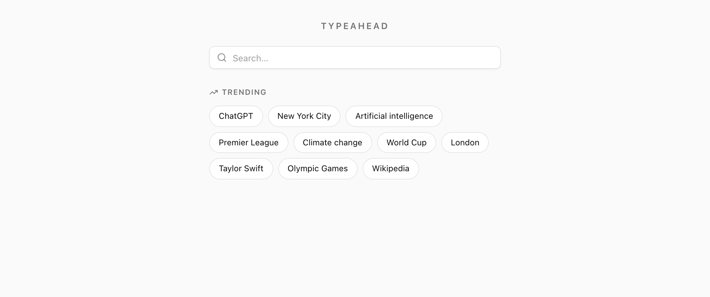
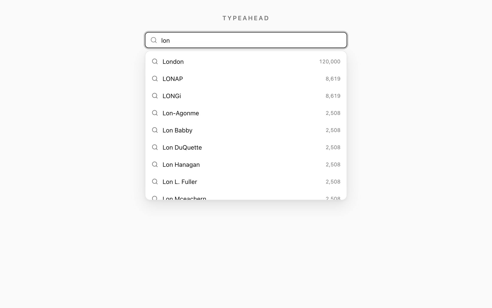
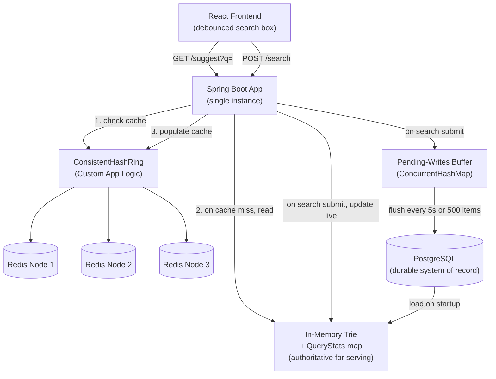

# Typeahead Search Typeahead System

Typeahead is a production-grade Search Typeahead System designed to suggest popular and trending queries dynamically as a user types. It features a React-based frontend, a Spring Boot Java backend, a persistent PostgreSQL database, and a custom-built distributed Redis cache layer utilizing consistent hashing.

**Key capabilities**

* **Prefix typeahead** — up to 10 suggestions served from an in-memory Trie in `O(prefix length)`, independent of dataset size.
* **Dual ranking** — an all-time-popularity `basic` mode and a recency-aware `trending` mode (exponential time-decay) from the same API.
* **Distributed cache** — suggestion responses cached across 3 Redis nodes via a custom **consistent-hash ring** (150 virtual nodes each).
* **Batch writes** — search submissions are buffered and aggregated into periodic bulk upserts (~2000× fewer database writes).
* **Polished UI** — debounced input, keyboard navigation, a trending panel, and loading/error states.

---

## 📸 Screenshots

**Trending on load** — the landing view surfaces the current top-10 trending queries as clickable chips.



**Live suggestions** — typing a prefix returns up to 10 ranked suggestions (with popularity counts) from the in-memory Trie, served in `O(prefix length)`.



---

## 🚀 Architecture Overview

Typeahead is built to withstand high-volume typeahead queries with sub-50ms latency. The data system architecture is structured as follows:



1. **In-Memory Trie**: Built inside the JVM heap, it serves as the authoritative, fast read structure. The top 10 results for each subtree prefix are cached directly at each `TrieNode` to allow O(prefix length) lookup times, completely independent of total records.
2. **Distributed Redis Ring**: Formed by 3 independent Redis nodes. A custom-built Consistent Hash Ring with 150 virtual nodes per physical node distributes query prefixes. It acts as a response cache for hot prefixes (e.g. "a", "s") with a 60-second TTL.
3. **PostgreSQL**: Serving solely as a durable system of record (never queried on the hot path). It stores all historical search queries and counts.
4. **Pending-Writes Buffer**: Under high search submission volumes, increments are accumulated in a local thread-safe buffer (`ConcurrentHashMap<String, LongAdder>`) and flushed to PostgreSQL asynchronously in a single batch upsert.

---

## 🛠️ Technology Stack

* **Frontend**: React (built with Vite)
* **Backend**: Spring Boot 3 (Java 17, Spring Data JPA, Actuator)
* **Primary Store**: PostgreSQL 16
* **Cache Ring**: Redis 7 (3 independent instances: `redis-node-1`, `redis-node-2`, `redis-node-3`)
* **Orchestration**: Docker Compose

---

## 📁 Project Directory Structure

```
Typeahead/
├── backend/            # Spring Boot REST Application
├── database-loader/    # Dataset Loader (processes Wikipedia dump)
├── frontend/           # React + Vite Web Application
├── docs/               # Architecture, API specifications, Performance records
│   ├── api.md          # API specifications and usage details
│   ├── architecture.md # Detailed architecture breakdown
│   ├── performance.md  # Latency, cache performance, and batch writing metrics
│   └── screenshots/    # UI screenshots used in the README
├── docker-compose.yml  # Docker orchestration configuration
└── README.md           # Getting started guide and project details
```

---

## ⏱️ Quick Start & Running Guide

Ensure you have **Docker** and **Docker Compose** installed on your system.

### 1. Build and Spin Up All Services
Run the command below in the `Typeahead` root folder. It will launch Postgres, populate the database with a million-record Wikipedia title dataset (applying Zipf distribution and trending news engineering), initialize the 3 Redis cache instances, build the backend & frontend containers, and verify service health:

```bash
docker compose up -d --build
```

### 2. Access the Application
Once all services are spun up and healthy, the welcome container outputs the success message.
* **Frontend UI**: [http://localhost:5173](http://localhost:5173)
* **Backend API**: [http://localhost:8080/api](http://localhost:8080/api)

### 3. Tear Down All Services
To cleanly stop and remove all container resources, run:

```bash
docker compose down -v
```

---

## 📈 Configuration & Parameters

Typeahead uses the following production defaults, which can be configured via environment variables or properties:

| Config Parameter | Default Value | Purpose |
|---|---|---|
| **Vite Debounce Delay** | `300ms` | Reduces backend load while the user is typing |
| **Redis Cache TTL** | `60s` | Expiration window for cached suggestion results |
| **Virtual Nodes** | `150` | Number of virtual positions per physical Redis node on the ring |
| **Batch Flush Timer** | `5s` | Asynchronous database flush interval |
| **Batch Flush Threshold** | `500 distinct` | Maximum buffered queries before triggering a flush |
| **Trending Half-life** | `6 hours` | Time-decay rate for popular breaking queries |
| **Historical Weight (W_HIST)** | `1.0` | Importance of overall popularity score |
| **Recency Weight (W_RECENT)** | `3.0` | Importance of recent activity spikes |
| **Dataset Size** | `1,000,000` | Wikipedia article titles populated on startup |

---

## 🧪 Documentation & Reports

All design rationale, measurements, and API contracts live in the [`docs/`](docs/) folder:

* **[docs/architecture.md](docs/architecture.md)** — system design, the three storage tiers, consistent hashing, the trending algorithm, and the batch-write pipeline.
* **[docs/api.md](docs/api.md)** — full endpoint specifications with sample requests/responses, including `GET /api/cache/debug`, which reports the cache key, hash, and owning Redis node for any prefix.
* **[docs/performance.md](docs/performance.md)** — measured latency (cold/warm p50–p99), cache hit rate, the ~2000× batch write-reduction, the consistent-hashing key distribution, and the basic-vs-trending ranking evaluation.

---

