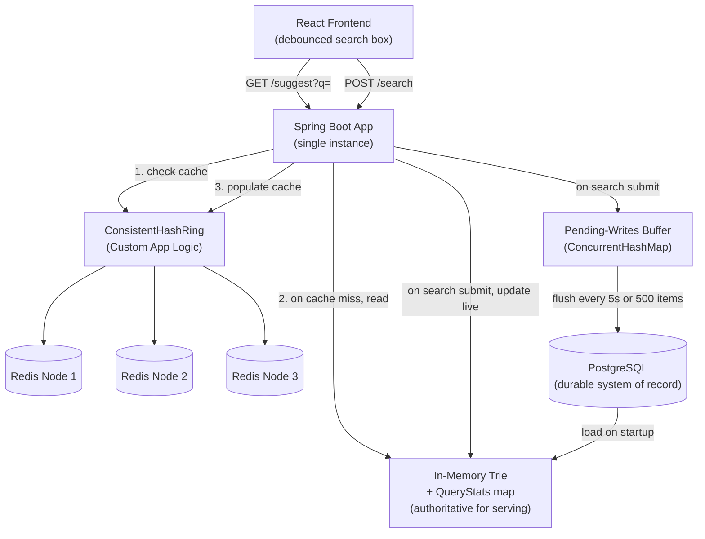

# Architecture: Typeahead Search Typeahead

This document details the architectural design of the Typeahead Search Typeahead system. The system is designed to provide ultra-low latency autocomplete suggestions while efficiently handling high-throughput search submission traffic, incorporating real-time trending data.

## 1. High-Level Architecture

The system avoids querying the primary database on the hot read path. Instead, it relies on a multi-tiered in-memory and caching strategy.

## 2. Core Components

### 2.1 The Three Storage Layers
1. **In-Memory Trie (The Engine):** The authoritative data structure for real-time serving. Lives entirely inside the Spring Boot JVM heap. Every node in the Trie caches the top 10 queries within its subtree, making lookups $O(L)$ where $L$ is the prefix length, completely independent of the dataset size.
2. **Distributed Redis Ring (The Cache):** A fleet of 3 standalone Redis instances acting as a read-through response cache. It caches the final JSON payload for specific prefixes for 60 seconds to absorb traffic spikes for highly popular queries (e.g., "i", "how to").
3. **PostgreSQL (The Vault):** The durable system of record. It is never queried during a user search. It is only read once during application startup to hydrate the Trie, and written to asynchronously in batches to persist search counts.

### 2.2 Custom Consistent Hashing
Instead of relying on Redis Cluster's internal slot management, the application implements its own Consistent Hash Ring (`ConsistentHashRing.java`). 
* **Mechanism:** Uses SHA-256 to map both physical nodes (with 150 virtual nodes each) and query prefixes onto a single mathematical ring.
* **Benefit:** If a Redis node fails or is added, only $K/N$ keys must be remapped to the next clockwise node, preventing a total cache eviction storm that a naive modulo hash (`hash % N`) would cause.

### 2.3 Trending Ranking Algorithm
The system supports two modes: `basic` (historical all-time popularity) and `trending` (recency-aware).
The trending score is computed on the fly using **Exponential Time-Decay**:

$$ \text{decayScore}_{\text{new}} = \text{decayScore}_{\text{old}} \times e^{-\lambda \Delta t} + 1 $$

Where $\lambda = \ln(2) / \text{HalfLife}$ (default 6 hours).

The final blended ranking score is:
$$ \text{trendingScore} = (W_{\text{hist}} \times \log_{10}(1 + \text{totalCount})) + (W_{\text{recent}} \times \text{decayScore}) $$
This allows a breaking query with low historical count to temporarily spike to the top of suggestions, eventually decaying back to its baseline after 24-48 hours.

### 2.4 Asynchronous Batch Writes
When users submit a search, writing to PostgreSQL synchronously would cripple throughput.
* **Buffering:** Submissions increment a `LongAdder` inside a `ConcurrentHashMap` in the `BatchWriteService`.
* **Flushing:** Every 5 seconds (or 500 distinct queries), the buffer is swapped lock-free and flushed to PostgreSQL.
* **Database Operation:** Uses JDBC batch execution with `INSERT ... ON CONFLICT DO UPDATE`, aggregating thousands of user searches into a single database transaction.
